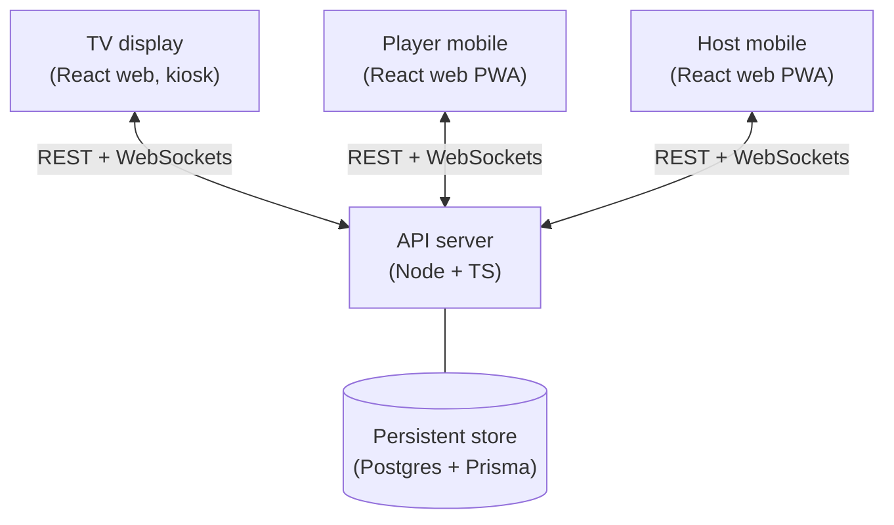

# Bar Trivia

Live trivia game built for bars. A host runs the game from a phone, players answer on their phones, and a TV displays the shared game state (current question, scoreboard, timer). The platform aims to make joining frictionless for casual players while rewarding registered players with persistent stats and in-game lifelines.

> **Status:** design only. ADRs and requirements are written; no code yet. The repo holds documents that describe what to build. Coding begins next session — start with the auth ADR, then the first Prisma schema, then a v0 vertical slice. See [CLAUDE.md](CLAUDE.md) for the load-bearing decisions and [docs/requirements.md](docs/requirements.md) for the product/behavioral spec.

## Architecture



The server owns all authoritative game state. Clients send actions (join room, submit answer, advance question) via REST, and receive state transitions via WebSockets.

## Clients

All three clients are React web apps. No React Native / Expo in MVP — see [docs/requirements.md, "Resolved"](docs/requirements.md#resolved) for the rationale.

- **TV display** (`packages/tv`) — plain React web app, fullscreen kiosk-style. The bar opens the URL in Chrome on a TV/stick PC and leaves it there. Shows the current question, choices, countdown timer, live scoreboard, and round/game transitions. Not a PWA (no install, no service worker — service workers cache aggressively and would slow bug fixes reaching the TV).
- **Player mobile** (`packages/player`) — React web app, mobile-first, PWA-installable. Players scan the TV's QR code and play in their phone's browser. No App Store install wall — that's load-bearing for the guest-play UX (see [docs/requirements.md §5.2](docs/requirements.md#52-joining-a-game)). PWA install (home-screen icon, full-screen mode) is opt-in for repeat players.
- **Host mobile** (`packages/host`) — React web app, mobile-first, PWA-installable. Same tech stack as the player. The host creates a room, picks a question pack, controls pacing, manages players, ends the game.

## Server

NestJS on Node.js + TypeScript, using the Express v5 adapter. Responsibilities:

- Game state machine (room lifecycle, rounds, questions, scoring)
- Player and host accounts
- Room code allocation
- Question pack storage and retrieval
- Realtime broadcast to room participants via Socket.IO (`@nestjs/platform-socket.io`)
- Authentication and authorization (guards, strategies, JWT)

## Auth model

Three identity tiers, all issued JWTs (short-lived access + refresh tokens). Role-based authorization (`guest`, `player`, `host`, `admin`).

| Tier                  | How they join                                          | What they get                                                                                                                                        |
| --------------------- | ------------------------------------------------------ | ---------------------------------------------------------------------------------------------------------------------------------------------------- |
| **Guest player**      | Room code + display name. No signup.                   | Play the current game. Session ends when the room ends.                                                                                              |
| **Registered player** | Email/password or Google OAuth.                        | Everything a guest gets, **plus**: lifelines (phone-a-friend, ask-a-neighbor, 50/50 remove-a-false-choice), persistent stats, game history, profile. |
| **Host**              | Email/password or Google OAuth. Always a full account. | Create and run games. Owns question packs. Game history and analytics.                                                                               |

Design intent: zero-friction entry for the casual bar player, with registration as a real upgrade path rather than a wall.

## Realtime

Socket.IO pushes game state transitions from the server to every client in a room:

- Question shown / hidden
- Answers locked
- Lifeline activated
- Scores updated
- Round and game transitions

Clients render off the broadcast; they do not compute authoritative state locally.

## Repo layout (planned)

Monorepo with npm workspaces. Aspirational layout; only the root and `docs/` exist today.

```
bar-trivia/
├── docs/             # design notes, ADRs, API contracts
├── packages/
│   ├── server/       # Node + TS API + WebSocket server
│   ├── tv/           # React web app for the bar TV
│   ├── player/       # React web (PWA, mobile)
│   ├── host/         # React web (PWA, mobile)
│   └── shared/       # shared TS types, API client, validation schemas
└── README.md
```

## Next steps

Documents done (the design):

- [x] Pick server stack (NestJS on Express v5; see [ADR 0001](docs/0001-server-stack.md))
- [x] Pick database (Postgres + Prisma; see [ADR 0002](docs/0002-database.md))
- [x] Draft MVP requirements ([docs/requirements.md](docs/requirements.md))
- [x] Decide client tech stack: all three clients are React web (TV is plain web, player + host are PWAs) — see [docs/requirements.md, "Resolved"](docs/requirements.md#resolved)
- [x] Competitive landscape survey ([docs/competitive-landscape.md](docs/competitive-landscape.md))
- [x] Auth ADR — hybrid JWT + Postgres refresh tokens, dual-ID identity, argon2id ([ADR 0004](docs/0004-auth.md))
- [x] v0 cut-list — the scope ceiling for what "playable at bar #1" actually means ([docs/v0-cut-list.md](docs/v0-cut-list.md))

Next session — begin coding:

- [ ] Scaffold from scratch: root `package.json` with npm workspaces, `packages/shared` (Zod schemas), `packages/server` (NestJS + Socket.IO bootstrap + `/health`)
- [ ] Add local dev tooling: `.nvmrc` (already in repo), `docker-compose.yml` for Postgres, root `dev` / `db:up` / `db:down` scripts
- [ ] First Prisma schema and migration: User (with role enum), RefreshToken, Pack, Question (with `data: jsonb`), Room, RoomParticipant — exactly what the v0 cut-list demands
- [ ] Define `docs/api.md` (REST endpoints + Socket.IO event contracts)
- [ ] First vertical slice: host creates a room, guest joins, one MC question end-to-end

Not yet started (later):

- [ ] Scaffold `packages/tv` (React web, kiosk)
- [ ] Scaffold `packages/player` (React web, PWA)
- [ ] Scaffold `packages/host` (React web, PWA)
