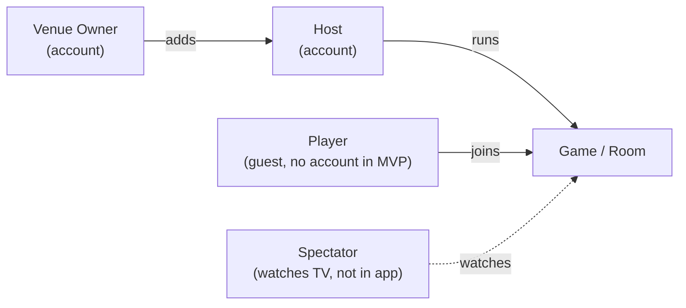
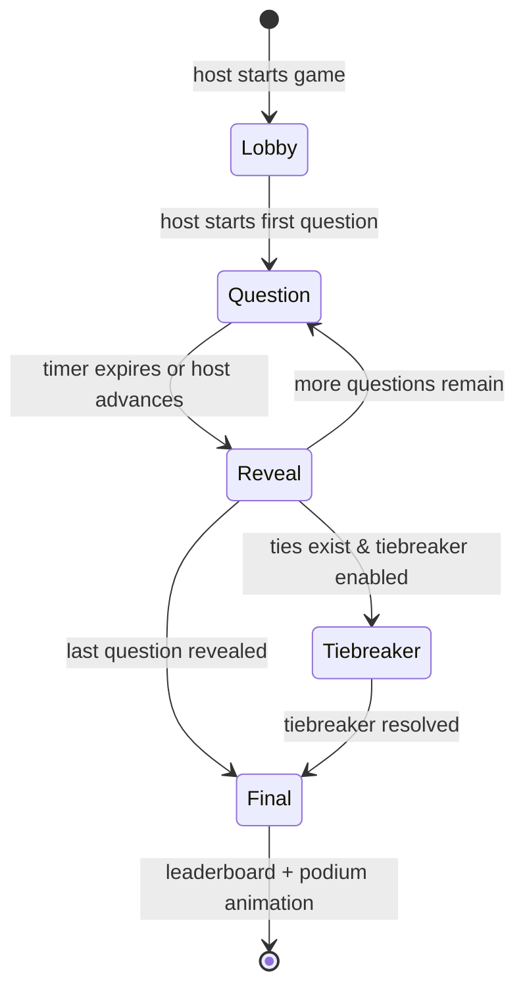

# Requirements: Bar Trivia MVP

- **Status:** Draft
- **Date:** 2026-05-20
- **Author:** John O'Conner (interviewed), drafted by Claude
- **Supersedes:** the earlier `docs/spec.md` and `docs/0003-requirements.md`, which are merged into this document.

This document captures product and behavioral requirements for the bar-trivia MVP. Architecture invariants and locked technical decisions live in [CLAUDE.md](../CLAUDE.md), [ADR 0001](0001-server-stack.md), and [ADR 0002](0002-database.md); this document does not re-litigate them.

Anything not nailed down here lives in **[Deferred decisions](#deferred-decisions)** at the bottom. Implementers should surface a deferred item rather than silently picking an answer.

---

## 1. Wedge — why this exists

Bar trivia today is run by paid human-host services (Geeks Who Drink, Trivia Mafia, etc.). They are expensive for the bar, unreliable (host no-shows kill the night), and slow to refresh content.

**For the bar:** cheaper, more reliable, and a broader content catalog (80s movies, sports, fashion, etc.) than a human host can offer.

**For the player:** the bar's TV leaderboard is a status game with stakes — drink specials, swag, bragging rights.

**Side benefit for the bar:** brings people physically into the venue. (Notifications / marketing that lean on this are v2.)

---

## 2. Vocabulary

Consistent terms across product, code, and docs.

| Term                 | Meaning                                                                                                                                                          |
| -------------------- | ---------------------------------------------------------------------------------------------------------------------------------------------------------------- |
| **Question**         | A single trivia item (prompt + correct answer + optional choices/media).                                                                                         |
| **Game** / **Round** | A themed set of `N` questions played start to finish. The two terms are interchangeable.                                                                         |
| **Pack**             | A bundle of games, typically themed by an evening or a category collection. Hosts load a pack to run a session.                                                  |
| **Room**             | A live instance of a game with a unique join code and a connected TV + host + players.                                                                           |
| **Session**          | One or more games played consecutively in the same room. **User-facing UI may call this a "Night"** ("Trivia Night at Murphy's"); the code/spec term is Session. |
| **Lifeline**         | A player aid (phone-a-friend, ask-a-neighbor, 50/50). **v2 feature; not MVP.**                                                                                   |

---

## 3. Roles

Three roles in MVP, plus a passive role. The platform may grow a separate `admin` (operator) role later, but it isn't required for MVP.

- **Venue Owner** — signs up for the service on behalf of a bar. Owns the venue's billing relationship, packs purchased/authored by the venue, and game history.
- **Host** — runs games for a venue. Has an account. Can author packs, configure games, kick players, and control pacing during a game.
- **Player** — joins a game as a **guest in MVP** with a generated display name and a room code. No signup, no persistent stats, no lifelines. Player accounts and the features they unlock are v2.
- **Spectator** — anyone in the bar watching the TV without joining on a phone. Not an app entity; called out so it isn't conflated with Player.

---

## 4. Game mechanics

### 4.1 Question formats (MVP)

All four supported:

1. **Multiple choice** — pick one of N preset answers (typically 4).
2. **True / false** — degenerate two-option multiple choice.
3. **Free text / short answer** — player types an answer; server fuzzy-matches against an accepted-answers list. _Matching policy: [deferred](#deferred-decisions)._
4. **Ordering / matching** — drag answers into order, or match pairs. _Partial-credit policy: [deferred](#deferred-decisions)._

### 4.2 Scoring

- **1 point** for a correct answer. 0 points for incorrect, unanswered, or timed-out.
- No speed bonus, no difficulty weighting.
- The server **always records each player's response time per question**, regardless of whether scoring uses it, because tie-breaking may need it (see §4.5).

### 4.3 Pacing

Each question has a **default timer** (configured by the pack, overridable by the host in the lobby — see §7.3).

The host has three real-time overrides during a question:

- **Pause** — freeze the timer.
- **Extend** — add time to the current question.
- **Advance** — reveal the answer immediately, before the timer expires.

When the timer expires (or the host advances), answers lock and the server reveals the correct answer to all clients.

The timer is the source of truth for game progression. The host's controls are strict overrides — see §6.3 for why this matters.

### 4.4 Question media

- **Text** (always present: prompt and any answer choices).
- **Images** — questions may include a single image, displayed on TV and player clients.
- Audio and video are **not** in MVP.

### 4.5 Tie-breaking

Tie-breaking method is **configurable per game or per pack** (whichever scope ends up cleaner; see deferred). Two options:

- **Sudden-death question** — tied players answer one or more tiebreaker questions until resolved.
- **Total response time** — sum of each tied player's response times across the game; lowest total wins.

The pack author (or host in the lobby) picks one. The server tracks per-question response times unconditionally so either method is available.

---

## 5. Lifecycle of a game

### 5.1 Starting a game (lobby)

1. Host opens a pack on their host client and selects a game.
2. Server creates a room with a short, human-readable **join code** (e.g. 4–6 chars).
3. The TV displays both the **join code** and a **QR code** that links to the player join flow.
4. Players join from their phones (guests in MVP) — see §5.2.
5. Host adjusts any knob overrides (see §7.3) and starts the first question.

### 5.2 Joining a game

- Players enter the room via the **join code** (typed) or **QR code** (scanned). Both are always shown.
- Players are **guests** in MVP — no signup, no auth.
- Each player is assigned a **generated display name** (e.g. "Curious Pelican"). A **reroll** button lets them get a different name. No free-text entry in MVP. _(In v2, signed-in players will be able to set a free-form name on their account; guests will still get generated names.)_
- The server assigns each guest a **stable client-side ID** (persisted in the player's device storage) so reconnects can resume the same identity.
- **Late join policy** is a per-game toggle the host sets in the lobby:
  - _Open:_ players may join during a running game; they start at 0 and play from the next question forward.
  - _Locked:_ once the game starts, no new players.

### 5.3 During a game

- Each question follows the pacing rules in §4.3.
- Players submit answers from their phones; the server records the submission and the response time.
- The TV shows: current question, choices (where applicable), a visible countdown, and the current leaderboard between questions.
- The player phone shows the answer affordance only. **Phone-text mode** controls how much extra context the phone shows (see §7.3):
  - _Heads-up_ (default): four colored A/B/C/D buttons matching the TV tiles, plus the player's own score and submitted/locked state. **No question text or choice text on the phone.** Encourages eyes-on-TV.
  - _Full_: question prompt, choice text, and the player's score. Used when the room can't reliably see the TV (accessibility, layout, large room).

### 5.4 End of a game

When the last question (or tiebreaker) resolves:

- The TV shows a **final leaderboard** for all players.
- The **top 3** get a **podium animation** (3rd → 2nd → 1st reveal).
- Players see their own rank and score on their phones.
- The host may start another game from the same pack or end the session.
- Physical prizes (drinks, swag) are handled by the bar outside the app for MVP; an in-app prize-claim flow is a [v2 item](#9-out-of-scope-for-mvp).

---

## 6. Connection handling

The server is authoritative; clients render off server state. Bar Wi-Fi is the design constraint.

### 6.1 Player disconnect

- A player who loses connection may **rejoin** within a grace window using their stable client ID (or the room code + their generated name).
- On rejoin, their score is intact.
- If the current question is **still open** when they reconnect, they may submit an answer for it. If it's already locked, they get the next question normally.

### 6.2 TV disconnect

- TV is read-only. On reconnect it resyncs from the server's current room state. The game does not pause for the TV.

### 6.3 Host disconnect

- The game continues on **auto-pilot from the timer** while the host is gone. No host overrides are available, but the game plays through end-to-end on the timer alone.
- The host may **rejoin at any time** and regain control.
- This is the load-bearing reason the timer (§4.3) is treated as source of truth: a game must be playable with no human in the loop.

---

## 7. Content: packs & questions

### 7.1 Authoring

- Both **venue owners** and **hosts** can author packs in-app.
- Both can also authorize packs for use at the venue (the exact authorization model is [deferred](#deferred-decisions)).

### 7.2 Marketplace

- MVP ships with **platform-curated free packs** and **host/owner-authored packs**. No payments in MVP.
- A **paid marketplace** (premium packs sold to bars, revenue share for third-party authors, curation criteria, refunds, etc.) is a **v2 feature** — see [Out of scope](#9-out-of-scope-for-mvp).
- This explicitly removes Stripe/billing infrastructure from MVP scope.

### 7.3 Pack configuration & host overrides

A pack ships with **defaults** for game-level knobs:

- Per-question timer length
- Number of questions per game (if the game has a variable size)
- Late-join policy default
- Tie-breaking method (sudden-death vs total response time)
- **Phone-text mode** (heads-up A/B/C/D only vs full question + choices on phone) — see §5.3

The **host may override** any of these in the lobby before starting the game.

### 7.4 Pack structure

Detailed pack metadata (categories, difficulty, age rating, image storage rules, file format) is [deferred](#deferred-decisions). What we know:

- A pack contains one or more games.
- A game contains one or more questions.
- A question carries: prompt, type (MC / T-F / free-text / ordering-matching), correct answer(s), optional image, optional choices.

---

## 8. v1 golden path

Concrete walkthrough of the MVP experience. Used to sanity-check scope decisions: anything that breaks this path is in scope; anything that doesn't appear here is a candidate for v2.

**Setup (already running before any player arrives):**

- TV at Murphy's shows the bar's logo, the join code (e.g. `MURP`), a QR code that links to the join URL, and "Trivia starts soon."
- Host's phone shows the lobby for tonight's session: pack selected, list of joined players (empty so far), Start button.

**Maria walks in at 8:15pm:**

1. Maria opens her phone camera and scans the QR on the TV (or types `MURP` into the join URL).
2. The server assigns her the generated display name **"Curious Pelican"** and a stable client ID stored on her phone. She taps **reroll** twice and lands on **"Plucky Otter."**
3. TV: "Plucky Otter joined!" Her name appears in the lobby list.
4. Host phone: Plucky Otter appears in the player list.

**Game starts:**

5. Host taps **Start Game**. The pack contains tonight's "80s Movies" game (20 questions).
6. TV shows a title card "Game 1 — 80s Movies" and a 3-second countdown.

**Each question (×20):**

7. TV: question text, four choices A/B/C/D in colored tiles, timer ring counting down.
8. Maria's phone (heads-up default): four big colored buttons matching the TV tiles, her current score, and submit/locked state. **No question or choice text on phone** — she watches the TV.
9. Maria taps **B**. Phone shows "Answer locked: B." Timer continues for everyone else.
10. Timer hits zero (or host advances). TV reveals the correct answer, leaderboard updates with a brief animation.
11. Next question.

**End of game:**

12. TV shows the **final leaderboard** for all players, then a **podium animation** revealing 3rd → 2nd → 1st.
13. Each player's phone shows their final rank and score.
14. Host may start another game from the same pack or end the session.

Maria's whole interaction: scan, reroll a name, tap A/B/C/D twenty times, see her rank, leave. No signup. No team. No prize-claim flow in the app — if she won swag, the host hands it over the same way they would for any bar promo.

---

## 9. Display names & moderation

- **Guests get generated display names** with reroll. No free-text entry in MVP.
- **Host kick** is available — the host can remove a player from the room from their roster view.
- Profanity filtering is not required in MVP because guest names are server-generated from a curated word list.

---

## 10. Non-functional

### 10.1 Scale

- **Up to ~100 players** per single game is the supported ceiling.
- **Beta target:** 2 hometown bars, hand-sold. Realistic peak per bar is well under the ceiling — a few dozen concurrent player devices in total across both bars during the beta period.
- Multiple concurrent rooms across the platform (platform-wide concurrency target [deferred](#deferred-decisions)).
- Comfortable in a **single Node process** with in-memory room state, per [ADR 0002](0002-database.md). Redis (for Socket.IO pub/sub and live room state) is the escape hatch if and only if multi-server scale forces it.

### 10.2 Reliability

- Per §6, the game must survive any single-client disconnect (player, host, or TV) without ending the game.
- The server is the only authority for scores, the current question, and the timer.

### 10.3 Other non-functional concerns

The following are real concerns we are **explicitly not pinning down in this draft**, because they don't gate MVP implementation but will need answers before launch:

- Latency target (e.g. p95 answer-submit ack)
- Device/browser support matrix (TV browser, mobile OS minimums)
- Accessibility (TV legibility from across a room; color contrast; color-blind safety on player phones)
- Internationalization / language support
- Privacy, data retention, GDPR/CCPA posture for guest player data
- Rate limiting (joins, answers, name rerolls)
- Anti-cheat (preventing double-submit from multiple tabs/devices per guest)
- Moderation tools beyond host kick (per-venue ban list, platform-wide bans)
- Observability (logging, metrics, alerts)
- Error UX (what each client shows on lost server connection)
- Support workflow (how a venue contacts ops when something breaks)

These all belong in [Deferred decisions](#deferred-decisions).

---

## 11. Out of scope for MVP

Called out so reviewers don't ask:

- **Lifelines** (phone-a-friend, ask-a-neighbor, 50/50) — v2.
- **Player accounts**, persistent stats, history — v2.
- **Free-form player display names** — ships with v2 player accounts.
- **Audio and video questions** — v2 or later.
- **Elimination-format games** — explicitly rejected.
- **Speed-bonus scoring** — explicitly rejected.
- **Cross-venue host accounts** (a single host working at multiple venues) — see deferred; default assumption is one host belongs to one venue.
- **Paid marketplace** (premium packs sold to bars, revenue share for third-party authors, billing, refunds) — v2.
- **Round structure within a Session** (e.g. the Geeks-Who-Drink eight-round format) — v2.
- **Persistent teams across sessions** (a team that comes back next Wednesday) — v2.
- **Weekly / monthly champions** — v2; only if MVP proves the demand.
- **Wager / final / bonus rounds** (teams bet a portion of their score on a question) — v2.
- **Push notifications** to players or venues — v2; depends on scheduling.
- **In-app prize-claim / handoff flow** (claim code → host confirm → swag handed over) — v2. MVP leaves prize handoff to the bar's existing process.
- **Pre-scheduled sessions** (recurring Tuesday 8pm) — v2; MVP is ad-hoc start only.

---

## Deferred decisions

Open items the project must resolve, grouped by urgency.

### Must resolve before/during MVP build

1. **Free-text answer matching policy.** Case-insensitive? Punctuation-insensitive? Plural-tolerant? Edit-distance threshold? Whose responsibility — the pack author lists accepted variants, or the server normalizes?
2. **Ordering/matching partial credit.** All-or-nothing per question, or proportional to how many positions/pairs are correct?
3. **Pack structure & metadata.** Categories, difficulty tags, age rating, image storage (S3-equivalent), file format for authoring (in-app DB only, or CSV/JSON import).
4. **Game scheduling model.** Ad-hoc ("start now") is the MVP default. Confirm no scheduling primitives sneak into the data model.
5. **Host onboarding & venue scope.** How does an owner invite a host? Does a host belong to exactly one venue, or many? Default assumption: one venue per host (see §11), but worth confirming.
6. **Permissions inside a venue.** Can hosts see/edit venue settings? See game history across the venue?
7. **Tie-breaking scope.** Is the tie-break method set at the pack level or the game level? §4.5 leaves both open.

### Should resolve before public launch

8. **Latency target** and how it's measured.
9. **Device/browser support matrix** (TV display browser, mobile minimums).
10. **Accessibility** standards (TV contrast/legibility from across a bar; player-app color-blind safety; minimum font sizes).
11. **Internationalization.** English-only MVP, or i18n from day 1?
12. **Privacy & data retention.** What we keep about guest players, for how long, GDPR/CCPA posture.
13. **Rate limiting** policy (joins, answers, name rerolls).
14. **Anti-cheat / dedup.** Stable client ID is per-device; what stops a player from joining twice on two devices and submitting two answers? Acceptable, or block it?
15. **Moderation tools** beyond host kick (per-venue bans, platform-wide bans, content reporting).
16. **Commercial model.** Subscription per venue, per-game fee, or some mix. Picked during beta based on real usage signal. Premium-pack sales are the most promising recurring lane.

### v2 prep (decide before building v2 marketplace)

17. **Marketplace mechanics.** Revenue share for pack authors. Curation criteria. Content review process. Refunds. Stripe (or equivalent), regions, currencies.
18. **Premium pack moat.** Packs are reusable (trivia has shelf-life) but also scrapeable. Defense strategy.

### Can be resolved post-launch

19. **Observability.** Logging stack, metrics, alerts.
20. **Error UX** for each client when the server is unreachable mid-game.
21. **Support workflow.** How a venue contacts ops when something breaks during a live game.
22. **Prize-claim UX.** If/when we add an in-app prize-claim flow, code-and-confirm is the obvious v1 of it; NFC/BLE tap-to-confirm is a possible refinement.

---

## Open architectural concerns

None currently open. Resolutions recorded below.

### Resolved

1. **Client tech stack — resolved 2026-05-20.** All three clients are React web. `packages/tv` is a plain web app (kiosk display on the bar's TV); `packages/player` and `packages/host` are PWAs (mobile web, optionally home-screen-installable). React Native / Expo is **not** in MVP scope.

   **Why:** the friction case for guest play (scan QR, play in 10 seconds) is incompatible with an App Store install wall — industry drop-off at "install this app to continue" is 40-70% and worse in a bar context. The player phone is a "buzzer" UX (heads-up A/B/C/D per §5.3); the TV is doing the visually impressive work, so the native UI advantages are largely irrelevant. The host case is one operator per bar — install friction is acceptable but not enough to justify a native build pipeline this early (App Store approval delays, EAS, $99/year Apple Developer Program, can't push fixes mid-trivia-night).

   **Reconsider native for `packages/player`** only if app-store discoverability becomes a real customer acquisition channel. **Reconsider native for `packages/host`** only on concrete operational pain from hosts during live games (frozen app, missed reconnects, etc.) — theoretical pain doesn't count. See CLAUDE.md "Locked decisions" for the codified version.
